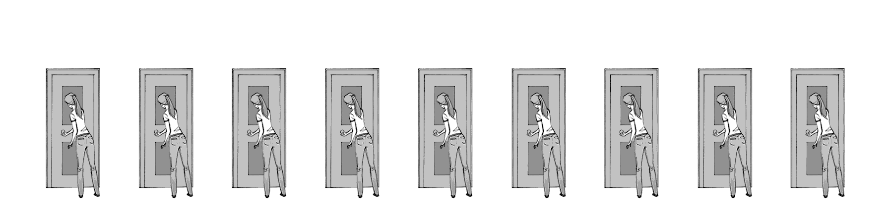
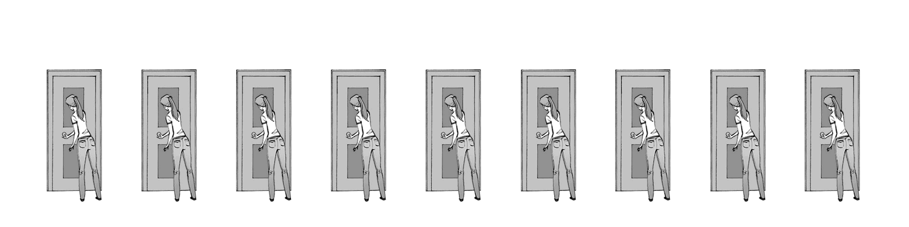

# Exponential Decay

::::{epigraph}
A quantity is subject to exponential decay if it decreases at a rate proportional to its current value. Symbolically, this process can be expressed by the following differential equation, where N is the quantity and $\lambda$ (lambda) is a positive rate called the exponential decay constant.  
:::{math}
  \frac {dN}{dt}=-\lambda N
:::

The solution to this equation is
:::{math}
  N(t)=N_{0}e^{-\lambda t}
::: 
where $N(t)$ is the quantity at time $t$, $N0 = N(0)$ is the initial quantity, that is, the quantity at time $t$ = 0, and the constant $\lambda$ is called the decay constant (ie. space constant, time constant).

-- [wikipedia](https://en.wikipedia.org/wiki/Exponential_decay) 
::::

A neuron (or any cell) is a membrane-enclosed sphere/cylinder. A voltage applied across the membrane at one location decays along the length of the membrane. The strength of this decay is determined by two things, the **time constant** and **space constant**. We can understand this phenomena with some math and electronics.

## Space Constant

For a neuron, the *space constant* is a measure of how far the voltage *travels*[^instantaneous-electricity] along the membrane. 

Mathematically, the space constant ($\lambda$) is well-predicted by the equation  
$\lambda = \sqrt{R_m/R_i}$  
where $R_m$ is the resistance across the membrane and $R_i$ is the resistance of the intracellular fluid (axoplasm).

[^instantaneous-electricity]: Importantly, it does not take any time for the voltage to "travel". Electrical *fields* are (practically) instantaneous. 

If you have a length constant of 1 mm, that means at 1 mm away from the cell body in an axon, 37% of the voltage magnitude remains. At 2 mm away from the cell body in an axon, 14% of the magnitude remains, and at 3 mm away, 5% remains. This is representative of an "exponential decay" function.

### Modifying a neuron's space constant

#### Myelin

Myelin is a fatty covering around the membrane that reduces the *leakyness* of the membrane (increases $R_m$)[^myelin-capacitance].

[^myelin-capacitance]: Covering the neurons with myelin makes the inside and outside of the neural membrane farther apart from each other. As capacitance is affected by the distance of separation between the charged bodies, myelin will decrease cm. 

What has been generally borne out with computer simulations is that a myelinated neuron twice as thick as another myelinated neuron will have a conduction velocity twice as fast[^byb-ref-myelin].

[^byb-ref-myelin]: [Background info for the Experiment: Comparing Speeds of Two Nerve Fiber Sizes](https://backyardbrains.com/experiments/comparingNerveSpeed)

#### Axon Diameter

The larger the radius of a neural compartment (ie. an axon), the smaller both $R_i$ and $R_m$ will be. Note that both $R_i$ and $R_m$ vary with the radius of the neuron's membrane, but with different functions. $R_m$ depends on the circumference by  
:::{math}
  R_m = \frac{r_m}{2*\pi*{radius}}
:::
where $r_m$ is a constant that can be measured from the neuron regardless of its size. 

While $R_i$ depends on the area by  
:::{math}
  R_i = \frac{r_i}{\pi * {radius}^2}
:::
where $r_i$ is a constant that can be measured from the neuron regardless of its size. 

By combining these equations and simplifying by eliminating constants, we find that the length constant scales with the square root of the radius ($\lambda \approx \sqrt{radius}$)

## Time Constant

For a neuron, the *time constant* is a measure of how long (time) it takes for the memrbane to *charge* to a stable voltage in response to an applied current.  

Mathematically, the time constant ($\lambda$) is well-predicted by the equation  
$\lambda = R_m * C_m$  
where $R_m$ is the resistance across the membrane and $C_m$ is the capacitance of the membrane. Capacitance effectively *buffers* otherwise sudden changes in voltage. 

## Neurophysiology of space and time

"Cable Theory", was originally developed in the 1800's when engineers were trying to understand signal transmission across long distance telegraph lines. Neuroscientists then applied this theory to neurons in the early 20th century.

Imagine a neuron with an infinitely high length constant and an infinitely low time constant. A voltage change anywhere in the neuron would instantly change the voltage everywhere else in the neuron. No such neuron exists.

Voltage propagation along a neuron membrane has a finite travel *distance*. **Active** (voltage-sensitive) ion conductances *fight* this decay by regenerating a trans-membrane voltage wherever they are activated (ie. an *action potential*). However, action potential propogation has a finite *speed*. Each time an ion channel needs to open to recharge the action potential, this delays the propagation of the action potential by approximately 1 ms. And the time constant of the membrane effects how quickly any patch of membrane will *charge*. Additionally, the smaller your length constant is, the more you have to regenerate the action potential by having ion channels open along the length of the axon. 

:::{figure-md}

Imagine a line of doors (ion channels) with people (gates) ready to open them when they hear the full phrase "open." And, when the vigilant finishes opening their own door, they then repeat the command "Open" which the next person hears. gif from ByB[^byb-ref-myelin]
:::

A space constant can be thought of as a measure of how loud the voice of the vigilants decreeing "open" is. If the "Open" is very loud, many vigilants can hear the open command at once, thus allowing many doors to open at the same time. This is equivalent to a high space constant. 

:::{figure-md}

Larger space constant means "faster" active propagation/conduction. gif from ByB[^byb-ref-myelin]
:::

## Additional Resources

- time and space constant text modified from Wyttenbach et al and [Backyard Brains](https://backyardbrains.com/experiments/comparingNerveSpeed).