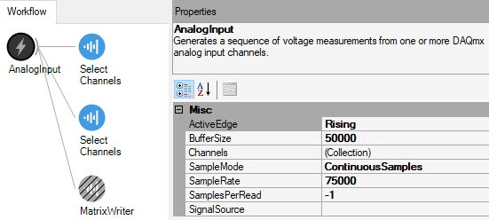
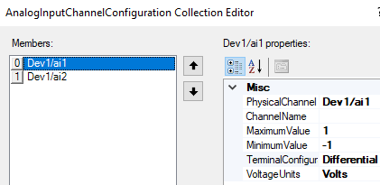

# Lab Manual

Today you will be using weakly electric fish and recording voltage in their tank using two sets of differential electrodes. 

## Software Setup
The bonsai workflow for today has an Analog Input node with two recording channels. 

:::{figure-md}
:class: figure



Bonsai workflow for dual channel differential EOD data visualization and acquisition.
:::


Each analog input channel is a *differential* electrodes, and the two differential electrodes are perpindicularly-oriented in the tank. *Differential* electrodes are referenced together for amplification, with a separate *grounding* electrode input into the circuit. The analog input is digitized by the Nidaq ADC before being streamed by Bonsai. By clicking on the **Analog Input** node, you can set the sampling rate of the ADC and buffer of the display in Bonsai. The sampling rate controls the ADC conversion and the buffer controls the size of chunks from the datastream that you can visualize at once in Bonsai. The electrode configuration for the **Analog Input** is specified in the ```Channels>{Collection}``` setting, which brings up the following window

:::{figure-md}
:class: figure



*Differential Electrode* settings for EOD data acquisition. Note that we will be using channels ai4 and ai5 so the PhysicalChannel may need to be changed on your workflow accordingly. The *Dev* number may also be different on your computer (this reflects which USB driver the device is connected to).
:::

The Matrix Writer node contains specifications for the file name and location where the file will be stored. Make sure the filename ends in ```.bin```. If **Overwrite** is set to ```False```, then your files won't accidentally be overwritten. You can choose to append a *timestamp* or a *file count* to each filename if you re-use the same filename. 

```{note}
Whenever you want to visualize the electrode measurements without accumulating stored data on the PC harddrive, just <font color = 'red'>DISABLE</font> the recording node.
```

## Core Experiment

1. Hook up the tank electrodes from a weakly electric fish tank to your ADCs input (channels 4 and 5).
2. Run the bonsai protocol (with the  **Analog Input** and **Select Channels** nodes <font color = 'green'>ENABLED</font> but the **Matrix Writer** node <font color = 'red'>DISABLED</font>. Double click the **Select Channels** nodes to visualize the measurement if it does not pop up upon start.

	:::{tip}
	You can set the y axis range on the live data plots explicitly so that the visualization does not jump around the screen. Right mouse click on the bottom of the plot window and unclick *auto*, then specify the min and max y-axis values.
	:::

	:::{tip}
	How could you determine which differential electrode corresponded to each channel in the Bonsai visualization?
	:::

3. Make sure that you can see EOD events in the signal (aka. make sure there is *signal above the noise*).
4. Stop the bonsai protocol and <font color = 'green'>ENABLE</font> the write node. 
5. When you are ready to collect data, start the bonsai protocol and time the recording for about 1 minute using a sampling rate of 100kHz (recommended *buffer* of 50kiloSamples would visualize 500msec chunks of data at a time in the plot at 100kHz samplerate).
 
	:::{admonition} **Keep track of your *meta*data**
	Make sure that you keep note of what the sampling rate is for each file you save (and the file's filname). Otherwise, you won't be able to recover that information later... and you will need that information to complete the analysis.
	:::

6. Repeat with different sample rates (10kHz and 50kHz)
7. Repeat for different species of fish (with 100kHz sample rate)

## Housekeeping

Clean up your area.  

Copy data to an external drive or your Google Drive for later.  

Use the [DataExplorer.py application](../../howto/Dash-Data-Explorer.md) to explore your raw data in detail. Use the [Data Explorer](../eod/Data-Explorer_eod.ipynb) notebook to process and analyse your raw data. Answer the questions in the [Responses](../eod/Responses_eod.ipynb) notebook.  

